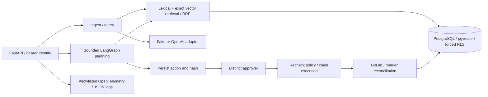

# OpsPilot AI

OpsPilot searches tenant-owned operational runbooks, returns answers with evidence references,
and can propose a GitLab issue for a second person to approve. The model proposes an action;
application code decides whether it is allowed and PostgreSQL records its lifecycle.

FastAPI → bounded RAG / LangGraph workflow → PostgreSQL with pgvector and forced row-level
security. OpenAI sits behind embedding, answer and planner adapters. GitLab execution uses a
separate HTTP adapter. OpenTelemetry traces connect requests, retrieval, approvals and execution.

Key decisions: tenant scope comes from credentials; retrieved text is untrusted; citation IDs
are validated against authorized context; approval binds to a canonical action hash; unknown
GitLab outcomes are reconciled before resending; telemetry failures stay outside product logic.

**Evidence:** retrieval-v2 held-out measured lexical / fake-vector / hybrid MRR@5 of
**0.7532 / 0.4375 / 0.6306** across 36 synthetic queries. The Phase 3 agent evaluation passed
16/16 cases using scripted/offline planners, real PostgreSQL and fake GitLab. These results
measure the exercised cases, not real model quality. See [retrieval evaluation](docs/evaluation/retrieval-v2.md)
and [agent evidence](docs/evidence/phase3/agent-eval-v1.json).

**Release status:** [v0.1.0 is published on GitHub](https://github.com/marcelotaparelli/opspilot-ai/releases/tag/v0.1.0).
Engineering release **PASS**, clean-room **PASS**, and GitHub Actions hosted runner **PASS**
(jobs `checks` and `terraform`). Final local validation passed 241 unit and 72 integration tests.
The image retains **44 HIGH unfixed / 0 fixable HIGH/CRITICAL** findings.
Terraform is a validated blueprint, not applied in production.
[Current status](docs/CURRENT-STATE.md) · [Local validation evidence](docs/evidence/release/README.md).

OPENAI LIVE EVIDENCE: NOT EXECUTED — CREDENTIALS NOT PROVIDED

GITLAB LIVE EVIDENCE: NOT EXECUTED — CREDENTIALS NOT PROVIDED

## Quickstart

Source pins Python 3.12.15, uv 0.12.23 in Docker/CI, and dependencies in `uv.lock`.
Use Docker Compose with a working daemon and network access. The fake provider requires no
provider credentials and produces deterministic hashed word vectors and extractive answers.

```bash
cp .env.example .env
# Replace example passwords and tenant tokens in .env; keep it local.
uv python install 3.12.15
uv sync --locked
docker compose --env-file .env config --quiet
docker compose --env-file .env up --build --detach --wait --wait-timeout 120
curl --fail http://localhost:8000/health
curl --fail http://localhost:8000/ready
```

With an empty volume, PostgreSQL creates the restricted `opspilot_app` role; the separate
migrator applies schema versions 1 and 2 under a transactional advisory lock; the API starts
only after migration succeeds. Existing v1 databases upgrade to v2. Changing `.env` passwords
does not rotate credentials inside an existing volume.

Set `OPSPILOT_TOKEN` in your shell to a configured tenant token, then:

```bash
curl --fail http://localhost:8000/v1/documents \
  -H "Authorization: Bearer $OPSPILOT_TOKEN" -H 'Content-Type: application/json' \
  -d '{"content":"Drain traffic, restart the service, verify readiness.","metadata":{"title":"Restart runbook","tags":["operations"]}}'
curl --fail http://localhost:8000/v1/query \
  -H "Authorization: Bearer $OPSPILOT_TOKEN" -H 'Content-Type: application/json' \
  -d '{"question":"How do I restart the service?","top_k":5}'
```

Compose ports bind to loopback. The final local runtime confirmed UID/GID 10001, read-only
root, writable `/tmp`, dropped capabilities and no new privileges, including in the clean-room.
See [runtime execution evidence](docs/evidence/release/container-metadata.json). Interactive docs
and `/openapi.json` are disabled by default. Development can
opt in with `EXPOSE_API_DOCS=true`; `APP_ENV=production` rejects docs exposure, HTTP GitLab
and recognized example credentials. Those checks do not prove credential entropy or TLS identity.

## Architecture and trust boundaries



Domain values and ports use dataclasses and `Protocol`; HTTP, database and SDK dependencies
stay in adapters. Pydantic validates contracts at those boundaries.

Ingestion normalizes NFC/line endings, creates 1,200-character windows with 200-character
overlap, embeds batches of at most 16 chunks, then stores text/vectors atomically. Retrieval
uses `vector(256)` exact cosine and PostgreSQL `simple` full-text search with OR terms and
`ts_rank`. Branches take up to `min(4*K, 80)` candidates. RRF uses constant 60 and UUID tie
breaks. Embedding-space IDs prevent cross-model vector comparison; lexical search spans
spaces. There is no ANN index, stemming or IDF.

SQL filters tenants before ranking/limits. Each transaction sets `app.tenant_id` locally;
pooled connections do not retain the previous transaction's tenant context. Forced RLS covers
seven tenant tables. Readiness checks schema v2, pgvector and a restricted role that cannot
own tenant tables or bypass RLS. Because that role can set the tenant GUC, RLS protects against
missing predicates/context leakage, not arbitrary SQL executed as that role.

The answer adapter requests strict output with `store=False`, explicit timeouts and zero SDK
retries. Application checks reject fabricated/duplicate citation IDs and invalid answers;
uncited output becomes a fixed abstention. Metadata comes from stored chunks. Citation
membership does not establish entailment. **Real API acceptance of the constrained schemas,
including `minLength`/`maxLength`, remains unmeasured.**

## Approval-gated agent

| Endpoint | Authority |
| --- | --- |
| `POST /v1/agent/runs` with `{request}` | `agent` role |
| `GET /v1/agent/runs/{id}` | same tenant |
| `POST /v1/agent/runs/{id}/approve` or `/reject` with `{action_hash}` | distinct subject, `approver` role |
| `POST /v1/agent/runs/{id}/resume` | same tenant, `agent` or `approver` role |

The planner can only search knowledge, prepare an issue or answer. Projects, labels and
assignees come from `AGENT_POLICY`. PostgreSQL persists proposals, decisions, execution claims
and an append-only audit trail. Approval binds to SHA-256 of canonical action JSON; execution
checks the stored hash and current policy again.

Lost GitLab responses and 5xx can conceal completed writes. Execution becomes ambiguous and
searches for its exact marker before resending. Recovery requires `/resume`; there is no worker.
A lease cannot fence an in-flight external request. Search visibility is unmeasured against
real GitLab. [Workflow, failure modes and limits](docs/architecture/agent-workflow.md).

Use `compose.smoke.yaml` alongside `compose.yaml` for disposable fake GitLab testing. This
override enables HTTP and needs development configuration. `scripts/smoke.py` and
`scripts/agent_smoke.py` document their required tenant/approver token variables.

## Observability and evaluation

Manual traces cover HTTP, retrieval, AI calls, policy, approval, execution and reconciliation.
Logs correlate request/run/trace IDs; response headers expose correlation IDs. Content and
secret attributes are excluded; metric labels reject high-cardinality IDs. AI spans distinguish
configured/served models, unknown usage and unknown cost. Costs use supplied `MODEL_PRICING`
and are estimates, not billing evidence. Framework-native telemetry is disabled.

```bash
OTEL_EXPORTER_OTLP_ENDPOINT=http://otel-collector:4318 \
  docker compose --env-file .env --profile observability up --build --detach --wait
# Jaeger: http://127.0.0.1:16686; metrics: http://127.0.0.1:8889/metrics
```

The optional profile does not control API availability. Export uses background queues and
bounded timeouts; telemetry can be lost. [Signals, redaction and Phase 3 load](docs/observability.md).

Retrieval-v1 was too easy to separate strategies. Retrieval-v2 adds paraphrases, identifiers,
ambiguity, multiple relevant documents, hard negatives and another tenant: 24 dev and 36
held-out queries. Lexical beat hybrid with the fake embedder; weak vector rankings hurt this
benchmark. That does not predict semantic-embedding results. The held-out split was consumed
once before subsequent phases and is never rerun in CI.

## Validation and release

```bash
uv lock --check
uv run --locked ruff format --check .
uv run --locked ruff check .
uv run --locked mypy
uv run --locked pytest -m 'not integration'
# Disposable real PostgreSQL / pgvector with migrated schema v2:
# set TEST_DATABASE_URL and TEST_ADMIN_DATABASE_URL for host access
uv run --locked pytest -m integration
./scripts/verify.sh
```

Integration tests fail if real database configuration is absent. They exercise tenant isolation,
pool reuse, migrations, approvals, concurrency, recovery and fake GitLab faults. CI also runs
retrieval-v2 **dev**, agent/security regressions, image build, full-history secret scanning,
dependency auditing, image vulnerability scanning, SBOM generation and Terraform validation.
Actions are commit-pinned; scanner archives are checksum-verified. The image gate blocks
fixable HIGH/CRITICAL findings and retains the full report, including unfixed findings. CI
excludes live providers, held-out execution and infrastructure application. GitHub Actions
passed completely on a GitHub-hosted runner for v0.1.0: jobs `checks` and `terraform` PASS.

The opt-in live scripts require credentials **and** their respective
`OPSPILOT_ALLOW_REAL_OPENAI_SMOKE=true` / `OPSPILOT_ALLOW_REAL_GITLAB_SMOKE=true` flags.
Missing configuration exits 2 before external work. OpenAI reserves at most nine requests,
with optional small database-backed RAG. GitLab requires HTTPS, a sandbox project and migrated
DB; it tests approval/create/confirm/conflict/resume/close and attempts cleanup after partial
failure. Use a project access token, Reporter role, `api` scope, short expiry and sandbox only.
Rehearsals remain separate from live evidence. No credentials are requested for this validation.

[AWS deployment and qualitative cost drivers](docs/deployment/aws.md): public ALB → ECS/Fargate
→ private RDS/pgvector, plus ECR, Secrets Manager and optional telemetry. No AWS deployment
was performed. Offline plans and scans passed for v0.1.0; the blueprint has not been applied
in production. Four deliberate IaC findings are classified in the [risk register](docs/evidence/release/iac-findings.md).

## Known limitations and records

Static tokens lack SSO, identity lifecycle and per-user quotas. There are no within-tenant
ACLs, automatic recovery workers, semantic rerankers or real-model quality measurements. The
AWS default has one API task, single-AZ RDS, broad HTTPS egress and optional single-NAT routing;
it has not been deployed or restore-tested. Local Docker runtime and release scans passed;
this does not establish AWS runtime or restore evidence.

- [Current state](docs/CURRENT-STATE.md) and [validation provenance](docs/VALIDATION.md)
- [Dependencies](docs/DEPENDENCIES.md), [ADRs](docs/adr/)
- [Portfolio summary](docs/portfolio-summary.md), [interview notes](docs/interview-notes.md)
- [Release handoff](docs/evidence/release/handoff.md)
