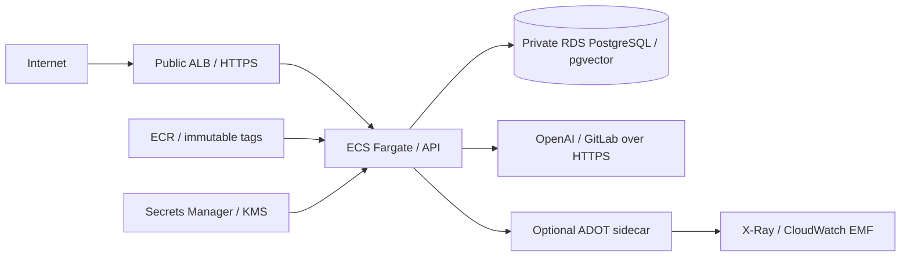

# AWS deployment blueprint

This document describes `infra/terraform`, not an executed AWS deployment. Phase 4 Terraform,
container and clean-room revalidation remain blocked in the continuation environment. No cloud
resources were created. Infrastructure application is outside this validation task.

## Topology

Two public and two private subnets span two configured AZs in a `10.40.0.0/16` VPC. Default
security group has no rules. ALB occupies public subnets. RDS occupies private subnets and
is explicitly non-public. Default tasks use public subnets/public IPs for outbound access,
accepting inbound only from the ALB security group. NAT is optional: enabling it moves tasks
to private subnets with no public IP and adds one NAT gateway/EIP. This follows the documented
[Fargate public-IP and private-NAT networking options](https://docs.aws.amazon.com/AmazonECS/latest/developerguide/networking-outbound.html).

Without NAT, private subnets have only local routing. With NAT, their shared route table gains
an internet default route. A single NAT in the first AZ is a failure domain and may add cross-AZ
traffic; it is not a redundant egress design. RDS still has no public address. VPC endpoints
are not provisioned. They could route AWS service traffic privately, but external OpenAI/GitLab
still need an outbound internet path.

## Security groups and ALB

ALB permits configured CIDRs on 80/443, defaulting to public ingress. Port 80 redirects to
HTTPS; HTTPS uses an operator-supplied ACM certificate. The configured
`ELBSecurityPolicy-TLS13-1-2-2021-06` supports TLS 1.3 and TLS 1.2; it is not TLS-1.3-only.
See [ALB policy definitions](https://docs.aws.amazon.com/elasticloadbalancing/latest/application/describe-ssl-policies.html).
Invalid headers are dropped. The ALB reaches task port 8000 over HTTP within the VPC; TLS
terminates at the ALB. There is no task-to-ALB end-to-end TLS claim.

API ingress is only TCP 8000 from ALB SG. ALB egress is only that port to API SG. Task egress
allows TCP 443 to any IPv4 destination, and TCP 5432 to DB SG. DB ingress is 5432 from task SG;
there is no general DB egress rule. Broad HTTPS egress is a documented risk, not a domain
allowlist. `/ready` drives ALB health. Idle timeout 75 seconds exceeds the default application
request deadline of 60 seconds; deregistration delay 20 exceeds Uvicorn's 15-second drain.
Changing application deadlines requires reviewing those margins.

## IAM and secrets

Execution role pulls only this ECR repository, obtains ECR account-level authorization, writes
to selected log groups, reads the named app/migration secrets and decrypts with the stack KMS
key. The same execution role is shared by both task definitions; splitting its secret grants
per task is future hardening. Runtime task role has no grants with telemetry off; with ADOT it
can publish X-Ray traces and write the configured EMF log group. All containers in the task
share that task role. The migration task's application role has no AWS grants.

Terraform creates secret **containers only**, never secret versions or values. RDS manages its
master password in Secrets Manager. API receives runtime `DATABASE_URL`, tenant-token map,
OpenAI key and GitLab token; the migrator receives only `MIGRATION_DATABASE_URL`. Populate values
out of band without placing them in Terraform variables, state, shell history or evidence.
Use URL-encoded passwords, runtime `opspilot_app` and TLS settings appropriate to asyncpg.
`ssl=require` requires encryption; deployment must separately verify certificate trust/identity.

ECS injects secrets at task start. Rotation needs new tasks and coordinated DB credential changes;
existing containers do not automatically receive new values.
[AWS secret injection and rotation behavior](https://docs.aws.amazon.com/AmazonECS/latest/developerguide/secrets-envvar-secrets-manager.html).
Never inspect a running task by printing all environment variables into logs/evidence.

## RDS and migrations

Default is PostgreSQL 17.6, `db.t4g.micro`, gp3 storage starting at 20 GiB with maximum 40 GiB,
KMS encryption and forced SSL. Seven-day backups, final snapshot, deletion protection and
PostgreSQL log export are declared. Multi-AZ defaults to false. IAM DB authentication and
Performance Insights are disabled and explicitly classified in the [IaC register](../evidence/release/iac-findings.md).
Check region/engine/pgvector availability before actual provisioning; none has been tested on RDS.

Bootstrap `opspilot_app` as NOSUPERUSER/NOBYPASSRLS without role/database creation or public
schema creation rights, using a controlled admin connection inside the VPC. The local
`init-db.sh` assumes a container superuser; adapt bootstrap grants to RDS's managed admin role.
The migrator must be able to create pgvector, tables and policies and grant the runtime role.
Runtime must not own tenant tables. API readiness verifies schema v2, extension, forced RLS
on all seven tenant tables and role restrictions.

Run the one-off migration task before deploying API revisions, wait for STOPPED and require
exit 0. Do not migrate per replica. The advisory lock serializes migrators; v1 data is preserved
by the v2 upgrade. Final migration tests and restore/rollback drills are pending. Image rollback
does not undo schema changes. The current slow-query logging parameter can expose bound
content in database logs; audit logging/redaction before ingesting sensitive data.

## ECS and observability

Default task is 512 CPU units / 1024 MiB, one replica. With the optional collector, 128 CPU units
and 256 MiB are allocated to ADOT; API receives the remainder. API runs as UID/GID 10001 with
read-only root, dropped capabilities, init enabled, and an explicit writable `/tmp` task volume.
The collector explicitly uses UID/GID 4317 and `--config=env:AOT_CONFIG_CONTENT`; its tagged
[source Dockerfile](https://raw.githubusercontent.com/aws-observability/aws-otel-collector/v0.43.3/cmd/awscollector/Dockerfile)
defines that user. The env config URI follows the [Collector configuration API](https://opentelemetry.io/docs/collector/configuration/).
This source check is not inspection/execution of the pinned image.
The migration task runs the same image/UID with a read-only root and no collector. ECS Exec is
disabled. Writable-volume ownership and collector compatibility require runtime validation;
no Fargate runtime proof exists.

Rolling deployment keeps 100% minimum healthy capacity, permits 200%, and enables circuit-breaker
rollback. Container liveness uses `/health`; ALB readiness uses `/ready`. A database outage removes
ready targets; a broken schema/role prevents startup. Missing secret values or blocked image-pull
networking prevent task initialization. One replica and single-AZ RDS limit availability.

API JSON logs use CloudWatch; optional localhost OTLP/HTTP goes to ADOT, then X-Ray traces and
CloudWatch EMF metrics. ADOT is nonessential. Logs use nonblocking buffers and may be lost.
KMS and default 14-day retention apply to stack log groups; rejected VPC flows are logged.
The local Collector/Jaeger profile is separate from this untested AWS export path. Alarm
thresholds, SLOs, restore drills and backend-redaction validation are operational follow-up.

## Deployment flow for an operator

1. Complete final release/clean-room gates and record the exact image, SBOM and full scans.
2. Review account/region/AZs, certificate, ingress CIDRs, TLS identity, DB availability and the
   risk register. Configure encrypted remote state and locking; the repository has no backend.
3. Provision infrastructure through a separately authorized deployment process. This task only
   validates files and offline plans. Terraform's service assumes its image/secrets/schema already
   exist; expect unhealthy initial tasks until bootstrap is complete, or stage service count at zero.
4. Publish a unique immutable image tag to ECR and record its registry digest. The blueprint
   references a tag, not `repository@sha256`; do not reuse `rc` across immutable releases.
5. Bootstrap DB roles, populate secret containers out of band, and execute the migration task
   with the configured task subnets/task SG/public-IP or NAT option. Require exit 0.
6. Deploy the API revision; wait for ready ALB targets and run health/RAG/agent/tenant smokes in
   a sandbox. Keep real provider calls explicitly opt-in and bounded.
7. Verify telemetry separately, reconcile ambiguous actions through `/resume`, monitor deployment
   failures and retain evidence without secrets. Review the ECR 20-image retention policy so it
   does not remove required rollback images.

## Qualitative cost drivers

| Driver | What changes spend |
| --- | --- |
| Fargate | Allocated CPU/memory, replicas, time running and overlap during deployments; collector shares the task budget. |
| RDS | Instance class, runtime, gp3/storage growth, backups/snapshots and Multi-AZ. |
| ALB | Running time and traffic/capacity usage; light workloads still have baseline resources. |
| NAT | Gateway runtime and processed data; adding per-AZ redundancy increases resources. |
| VPC endpoints | Interface endpoints add per-AZ resources/data costs; not provisioned here. Evaluate against NAT/AWS-service traffic. |
| Logs/telemetry | Ingest volume, retention, EMF metrics, X-Ray traces, queries and enabled Container Insights. |
| OpenAI API | Actual model usage, embedding volume, prompt/output size and configured account limits. Local fake measurements are not spend forecasts. |
| Egress | Internet and cross-AZ traffic; image pulls and telemetry add transfers. |

No exact monthly estimate is claimed. NAT is optional because tasks can reach external HTTPS
from public subnets while their SG only accepts ALB ingress. This removes the gateway baseline
for a small demo at the cost of public task addresses and stricter dependence on SG correctness.
A real estimate requires region, workload, uptime, redundancy and current prices.
